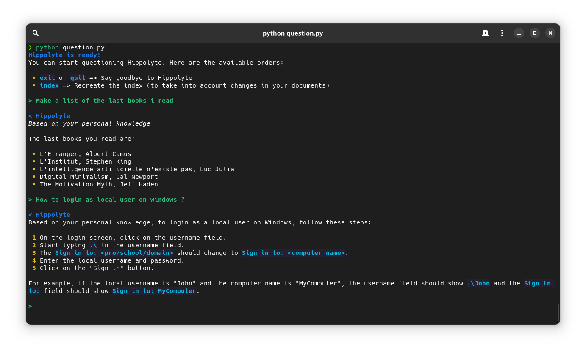

# Hippolyte (LLM Assistant based on your knowledge)

The current LLM assistants answer us with the knowledge they have gathered during their training. But some of us already have some recorded knowledge that is just waiting to be used.

The goal of this project is to build a personal assistant, like ChatGPT, but that answers you based on your documents.
Hippolyte can currently be used to answer using your **Logseq** or **Obsidian** graph!


## Roadmap

The work will mainly aim at:

- Using other LLMs (like [alpaca.cpp](https://github.com/antimatter15/alpaca.cpp))
- Provide a chat with a context (ChatGPT-like discussion)
- Support more knowledge sources (directory of pdf, ebooks...)


## Installation

Install dependencies

```bash
    pip install -r requirements.txt
```

Create a `.env` file (make sure to replace at least the values between <>)

```env
ASSISTANT_NAME=Hippolyte
VERBOSE=True
OPENAI_API_KEY=<your openai api key>
MODEL=gpt-3.5-turbo
DOCUMENTS_PATH=<path to your documents (logseq / markdown dir)>
```

**Run the assistant!**

```bash
python question.py
```

The first start may be long, because we need to create the index.
## 🤝 Contributing

Contributions, issues, and feature requests are very welcome!


## License

[MIT](https://choosealicense.com/licenses/mit/)
